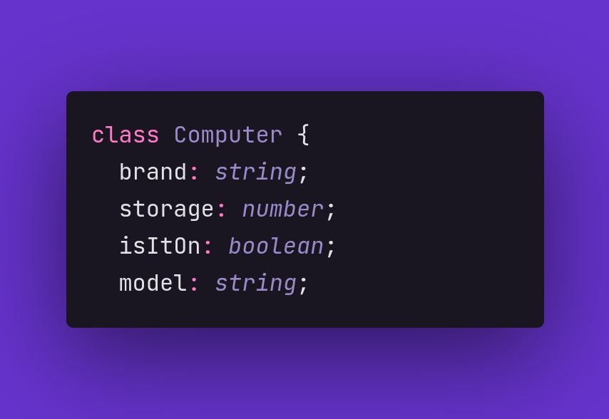

# Interfaces

Forma de modelar dados para a criação de um objeto, a sua própria materialização, representa toda a abstração por trás de algo que podemos visualizar no mundo real.

Um objeto é a criação de uma entidade a partir de uma classe.

A classe é o modelo e o objeto  o que é construído a partir dela.

  

# Configurando o ambiente e executando

Use `npm install typescript` para instalar o typescript.

Use `npm install ts-node` para instalar o ts-node.

Use `npx ts-node index.ts` para executar o arquivo.